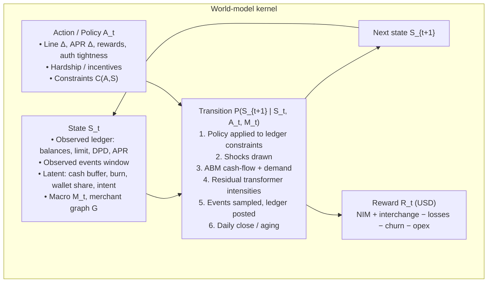
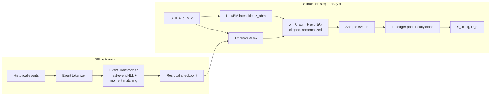
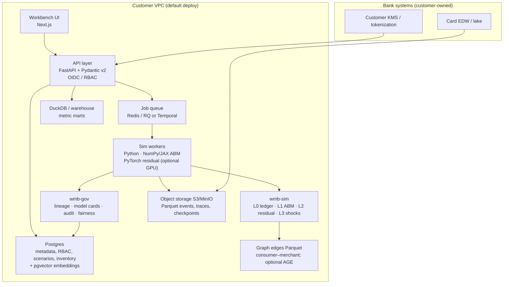
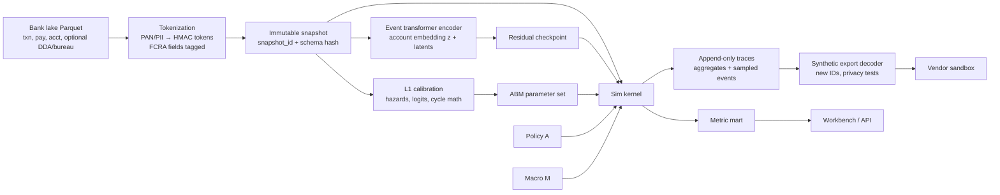
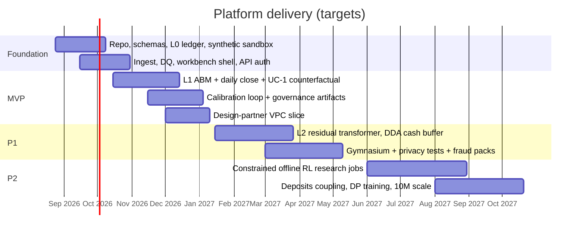

# World Model for Banking — Platform PRD & Technical Design

| Field | Value |
| --- | --- |
| **Document** | Product Requirements Document (PRD) + Technical Design |
| **Product** | World Model for Banking |
| **Author** | Product & Engineering |
| **Date** | 2026-08-22 |
| **Status** | Draft |
| **Horizon** | 18-month platform; MVP in 3–4 months |
| **Audience** | Founding engineering, product, model risk, and design partners |
| **Classification** | Internal — pre-customer; no production bank data assumed |

This document is both a PRD and a system design. It is written so a founding team can stand up a repository, schemas, simulation kernel, APIs, and a first counterfactual workbench without an existing codebase. Quantified targets below are **design targets**, not measured facts.

---

## Overview

Retail banks and card issuers can simulate market risk and capital-markets microstructure with mature world models, but they cannot yet ask operational counterfactuals about *people, cash, and payment networks*: *If we cut this cohort’s credit line by 20% during an inflationary spike, how do default rates, spending displacement, and deposit retention change over 18 months?* Existing scorecards, Champion/Challenger tests, and Monte Carlo PD/LGD/EAD engines answer a different question. They score a snapshot or shock a parametric loss vector; they do not generate the event-level life of a household under a new policy.

**World Model for Banking** is a generative simulation platform for retail banking and credit cards. It maintains a state \(S_t\) over consumers, accounts, merchants, and macro climate; applies issuer actions \(A_t\); samples transition dynamics \(P(S_{t+1} \mid S_t, A_t)\); and emits rewards \(R_t\) in dollars (NIM, interchange, credit losses, churn, LTV). v1 is a **decision-support simulator** deployed in the customer’s VPC. It is not an automated credit decisioning engine. Closed-loop production policy from RL agents is an explicitly gated later phase.

The platform has four product surfaces: (1) a world-model core, (2) a scenario workbench UI, (3) APIs for simulation, synthetic export, and offline RL training loops, and (4) governance (lineage, fairness constraints, model cards, audit logs). The canonical MVP is a single revolving-card portfolio answering the credit-line counterfactual above with calibrated, auditable traces.

---

## Problem Statement

### The job that is unsolved

Credit and card leaders need to evaluate **interventions on a living payment system**: line increases/cuts, APR changes, authorization strategy, rewards multipliers, hardship programs, and collections timing. The outcome is delayed (90–180 day delinquency; multi-month churn), graph-coupled (consumer ↔ merchant substitution), and psychologically boundedly rational (habit, liquidity, life events)—not instantaneous market clearing.

A useful answer is a **distribution over 12–24 month paths**: spend, repayment, utilization, default, interchange, NIM, wallet share, and competitor substitution—conditionally on a policy and a macro path. That is a world model. Banks do not have one.

### Why current tools fail this job

| Tool | What it does well | Why it fails the world-model job |
| --- | --- | --- |
| **Application / behavior scorecards (logistic, GBM, scorecard points)** | Rank-order PD or response at a decision point | Static \(P(Y \mid X)\). No \(P(S_{t+1} \mid S_t, A_t)\). Cannot generate spend displacement, merchant substitution, or delayed default after a line cut. |
| **Champion/Challenger and RCT** | Unbiased estimate of a live policy | Slow (months), expensive, ethically and reputationally constrained for harmful treatments (line cuts in a recession). Cannot explore 50 macro × 20 policy cells. |
| **Monte Carlo PD/LGD/EAD / Vasicek / ASRF** | Capital and CECL *loss* distributions given PD term structures | Shocks a loss vector, not a household. No cash-flow identity, no authorization/decline routing, no wallet-share, no interchange, no rewards P&L. |
| **CCAR/DFAST nine-quarter models** | Regulatory capital under supervisory scenarios | Portfolio-level, highly aggregated, not designed for product-policy search or event-level fraud/AML. Challenging to use for a 10k-account cohort experiment. |
| **Capital-markets / brokerage world models** | Stochastic prices, LOB, liquidity, market impact | Wrong state, wrong agents, wrong timescale. Prices are fast and continuous; card events are discrete, irregular, and habit-driven. Instantaneous clearing vs 90–180 day payoffs. Asset-correlation graphs vs bipartite consumer–merchant graphs. |
| **Rules + Champion fraud engines** | Precision/recall on observed attack types** | Blind to attacks that have not occurred. Cannot simulate fraud rings or structuring paths that the rules have never seen. |
| **Generic synthetic-data tools** | Schema-shaped fakes | Fail joint temporal, graph, and constraint structure (balances, credit limits, FCRA/GLBA leakage). Not calibrated to PD curves or wallet share. |

The gap is not “better PD.” The gap is a **calibrated generative simulator of the financial lifecycle** that institutions can query with counterfactual policies, under governance that SR 11-7 / OCC model-risk programs will accept as *decision support*.

### Pain points (current state)

1. **Policy search is live or not at all.** Line-management and rewards changes go to production via Champion/Challenger because offline simulators are not trusted.
2. **Stress tests are not product tests.** Macro scenarios hit PD/LGD grids; they do not tell a Head of Card what happens to interchange if utilization is forced down.
3. **Fairness review is post-hoc.** Disparate-impact analysis happens after a model is fit, not inside a constrained policy optimizer with auditable trade-off curves.
4. **Sandbox data is either too clean or too real.** Internal DS teams overfit to production traces; vendors cannot receive raw PAN/PII. Fraud research is starved of realistic, legally shareable attack paths.
5. **Feedback is slow.** Default labels arrive a quarter later; by then the macro climate and the card’s wallet position have moved.

---

## Vision & Product Thesis

**Vision.** Every material credit, fraud, and card-product decision is first run through a governed world model of household cash flows and payment networks—the same way a markets desk will not size a book without a simulator.

**Thesis.** A retail-banking world model is not a faster scorecard and not a capital-markets price engine. It is a **multi-agent, event-driven cash-flow simulator** with:

- a **mechanically consistent ledger** (balances, limits, min-pay, interest, DPD) so every path obeys accounting identities;
- a **learned residual behavioral layer** so habit, wallet share, and merchant substitution match data rather than folklore;
- an **explicit action space** of issuer policies, with constraints for fair lending, credit appetite, and operational feasibility;
- a **dollar reward** that composes NIM, interchange, losses, and churn into risk-adjusted LTV;
- **governance-native artifacts** (model cards, lineage, fairness reports, audit logs) so Model Risk Management can inventory it as a simulation model, not a shadow bureau.

**v1 product promise (one sentence).** For a single revolving-card portfolio, a risk or decision-science team can load historical events (or a synthetic twin), define a cohort and a policy (e.g., −20% line on high-utilization revolvers), attach a macro path, and overnight obtain calibrated distributions of default, spend displacement, interchange, NIM, and LTV over 18 months—without moving raw data off the bank’s VPC, and without using the simulator as an automated decision engine.

---

## Background & Motivation

### Why now

- **CECL and capital.** Lifetime-loss measurement and stress overlays reward path-consistent cash-flow models, not just through-the-cycle PD.
- **Real-time line management.** Issuers can change limits intra-cycle; bureau-monthly scorecards lag the risk trajectory.
- **Rewards as a steering wheel.** Category multipliers are policy actions with measurable substitution and interchange effects.
- **Privacy and vendor constraints.** Banks will not ship raw traces to a SaaS GPU cloud. A world model that *generates* privacy-preserving twins unblocks vendors, labs, and offshore development.
- **RL is usable only with a simulator.** Offline RL on logged bandit data cannot evaluate line cuts that were never taken. A world model is the missing environment.

### Retail banking vs brokerage world models

| Dimension | Capital markets / brokerage | Retail banking & credit cards (this platform) |
| --- | --- | --- |
| **State dynamics** | Fast, high-frequency, continuous prices and limit order books | Discrete, irregular event streams: paychecks, autopsies, retail swipes, minimum payments |
| **Agent psychology** | Profit-maximizing, game-theoretic, latency-sensitive | Habit-driven, boundedly rational, constrained by life events and liquidity |
| **Feedback loop** | Instantaneous market clearing and price impact | Delayed payoff: defaults 90–180 days; churn gradual; interchange contemporaneous |
| **Graph topology** | Asset correlation, cross-asset contagion | Bipartite consumers ↔ merchants; P2P payment networks; issuer–network–acquirer rails |
| **Time base** | Microseconds–minutes | Event time + daily close; weekly/monthly reporting |
| **Primary reward** | PnL, inventory, adverse selection | NIM, interchange, credit loss, churn, LTV |
| **Regulation** | Market risk, best execution | SR 11-7, ECOA/Reg B, FCRA, GLBA, BSA/AML, CECL, CCAR/DFAST-adjacent |

World Model for Banking is built for the right-hand column. It does not simulate order books.

---

## Goals & Non-Goals

### Goals (18 months)

1. Ship a **governed simulation platform** that a mid-to-large issuer can run in-VPC on their card events.
2. Answer the **canonical credit-line counterfactual** for one portfolio with documented calibration and uncertainty.
3. Produce **privacy-preserving synthetic event datasets** that pass membership- and attribute-inference tests at agreed thresholds.
4. Expose a **Gymnasium-compatible environment** so research can train constrained offline RL *in sim*—without a path to production decisioning in v1.
5. Give MRM **SR 11-7-shaped artifacts**: conceptual soundness, developmental evidence, ongoing monitoring spec, model card, lineage.
6. Support **fraud/AML red-teaming** via adversarial scenario packs (synthetic rings, structuring) against frozen detection models.

### Non-goals / out of scope

See also **Out of Scope**. Explicitly not in v1–v1.5:

- Automated credit approval, line change, or adverse-action generation in production.
- Using latent embeddings as ECOA adverse-action reasons.
- Capital-markets, brokerage, market-making, or HFT simulation.
- Being the system of record for accounts, ledgers, or authorizations.
- Replacing the bank’s CECL or CCAR production models (World Model for Banking may *inform* overlays; it does not file the FR Y-14).
- Full deposit-beta / AUM world model as a required MVP surface (hooks only).
- Real-time authorization scoring in the card network hot path.
- Consumer-facing products.

---

## Personas & Jobs-to-Be-Done

### Primary buyers

| Buyer | Success looks like |
| --- | --- |
| **Chief Risk Officer** | Can evidence that line and underwriting policies were simulated under stress and fair-lending constraints before rollout. |
| **Head of Credit / Card** | Can compare line, APR, and rewards policies on risk-adjusted LTV, not just 30-day spend lift. |
| **Head of Fraud / AML** | Can attack the detection stack with synthetic rings before criminals do. |
| **Model Risk Management** | Can inventory World Model for Banking as a simulation/decision-support model with SR 11-7 artifacts and no hidden production decisioning. |
| **Head of Data Science / Decision Science platforms** | Gets a standard environment, APIs, and synthetic sandboxes so every squad is not building a one-off simulator. |

Primary customer: mid-to-large US banks, card issuers, and fintech lenders. EU/UK hooks (GDPR, PSD2/Open Banking, PRA model risk) are designed in, not implemented first.

### Primary users

| Persona | Jobs-to-be-done |
| --- | --- |
| **Credit risk modeler** | Calibrate PD/EAD-like outcomes *and* cash-flow paths; test line-management policies; export challenger evidence. |
| **Stress-testing analyst (CCAR/DFAST-adjacent)** | Map supervisory or custom macro paths into household shocks; produce portfolio loss, NIM, and spend paths at quarterly granularity. |
| **Fraud / AML scientist** | Generate fraud-rich twins; inject typologies; measure detection recall vs false-positive cost under substitution. |
| **Card / rewards product manager** | Simulate category multiplier changes; see spend cannibalization vs incremental interchange. |
| **Policy / decisioning engineer** | Encode action constraints (max line change, hardship eligibility); run batch counterfactuals; pull metrics into existing decision platforms. |
| **MRM reviewer** | Read model card, conceptual soundness, data lineage, fairness report; confirm v1 is not in the decisioning path. |

### JTBD (outcome-oriented)

1. When I must change credit lines for a risk cohort, I want to see 18-month distributions of default, spend, and LTV **before** I harm customers or capital, so I do not rely on a live test.
2. When the Fed or CRO publishes a stagflation path, I want the **same household engine** I use for product policy, so stress and strategy do not live in two incommensurable models.
3. When I cannot give a vendor raw cards data, I want a **statistically faithful, legally shareable twin**, so development does not stall.
4. When I train a line-management policy with RL, I want **hard fairness and loss constraints in the environment**, so the policy is not clever and illegal.
5. When MRM asks “why should we trust this?”, I want **artifacts, not a slide**.

---

## User Stories / Use Cases

Acceptance criteria are testable. “Given / When / Then” plus numeric gates use **design targets**.

### UC-1 — Canonical counterfactual: credit-line cut under inflation (P0 / MVP)

**Story.** As a credit risk modeler, I load Portfolio P (revolving card), select cohort C = `{utilization ≥ 70%, 3-cycle revolver, risk-grade B–C}`, set action \(A\) = “multiply credit limit by 0.80 at \(t_0\), freeze increases for 6 months,” attach macro path \(M\) = “CPI +6% year 1, unemployment +150 bps, fed funds unchanged,” and simulate 18 months.

**Acceptance criteria**

1. Given a validated input bundle (see FR-010), When I create scenario `line_cut_20_inflation` and run \(K \ge 100\) Monte Carlo paths on \(|C| \ge 10{,}000\) accounts, Then the workbench shows, at monthly points 1…18, distributions (p10/p50/p90) of: cohort default (90+ DPD or charge-off), gross spend, interchange, NIM, utilization, voluntary churn, and estimated competitor-card substitution spend.
2. A **baseline** path with \(A = \) no-op is run with the same seeds / antithetic draws so treatment effects are paired.
3. Accounting identities hold on every sampled full trace: `balance_{t} = balance_{t-1} + purchases + fees + interest − payments − chargeoffs − other_credits` within $0.01.
4. Interactive cohort run (\(\le 10{,}000\) accounts, 18 months, 50 paths, daily close + event intensities, aggregate-only traces) completes in **< 2 minutes p95** (target).
5. User can export: (a) metric parquet, (b) model card snapshot, (c) fairness slice (see UC-1a), (d) audit log id.
6. No path writes to the issuer’s account-management system.

**UC-1a Fairness slice (P0).** Same run reports outcomes sliced by protected-class proxies **only if the bank supplies those attributes under their policy**. If absent, report by geography and risk grade only, and the UI states that ECOA disparate-impact analysis is incomplete. Latent embeddings are not inputs to this report.

### UC-2 — Stress testing & macroeconomic scenario planning (P0 for quarterly rollup, P1 for supervisory mapping)

**Story.** As a stress-testing analyst, I bind a scenario pack (baseline, adverse, severely adverse—customer-supplied paths; optional mapping from public CCAR-like variables: unemployment, HPI, CPI, fed funds, disposable income) and generate portfolio-level lifetime-loss and NIM paths.

**Acceptance criteria**

1. Macro variables are ingested as monthly series and interpolated to daily close.
2. Idiosyncratic shocks (job loss, medical) have intensities that are functions of macro *and* account state; this mapping is versioned and visible in the model card.
3. Outputs include CECL-like undiscounted and discounted lifetime loss, 9-quarter cumulative net charge-off, and NIM, at portfolio and segment.
4. A holdout historical crisis window (customer-chosen, e.g. 2020 Q2 or 2008–09 if data exist) can be **backtested**: predicted vs realized segment default and spend curves with published metrics (see Evaluation).
5. World Model for Banking output is labeled **decision support / overlay research**, not a Y-14 replacement.

### UC-3 — Offline RL for credit risk (P1 environment, P2 production-adjacent)

**Story.** As a decision scientist, I train a policy \(\pi(A \mid S)\) inside World Model for Banking to maximize risk-adjusted LTV subject to loss, fairness, and operational constraints.

**Acceptance criteria**

1. Environment implements the Gymnasium API: `reset(seed, options) -> obs, info`, `step(action) -> obs, reward, terminated, truncated, info`.
2. Observation is a **documented, non-embedding** feature vector suitable for policy research (see State spec). A separate research flag can attach latent embeddings; this flag is incompatible with “MRM-exportable policy” artifacts.
3. Reward is the composite dollar reward (Reward spec) with configurable weights.
4. Constraints are first-class: max line Δ per cycle, max portfolio loss rate, fairness metric placeholder (see Open Questions), max authorization-decline rate.
5. Training jobs write: policy checkpoint, constraint-violation traces, seed, env and model versions, and a **not-for-production** watermark.
6. There is **no API** in v1 that pushes \(\pi\) into the issuer decisioning bus. A `submit_policy` API stores the artifact for evaluation only (`status: proposed_in_sim`).

### UC-4 — Synthetic data generation (P0 sandbox, P1 DP / tests)

**Story.** As a platform lead, I export a statistically similar, PII-free event dataset for a vendor sandbox.

**Acceptance criteria**

1. Exported events use synthetic `account_id` / `customer_id` / `merchant_id` tokens with no invertibility to bank IDs (HMAC with bank-held key, or fully sampled IDs).
2. Joint distributional metrics vs holdout (see Evaluation) meet MVP gates for amounts, MCC mix, inter-event times, repayment, and 30/60/90 DPD curves.
3. Privacy tests: membership inference AUC **≤ 0.55** target on a held-out attack model; attribute-inference F1 for rare MCCs and exact paycheck amounts below documented thresholds. Failures block export unless an officer override is logged.
4. Optional differential privacy training path exists as P1 (account-level DP-SGD on residual models); MVP may ship with de-identification + tests only.
5. Fraud-rich mode: user can up-sample labeled fraud typologies **without copying raw fraudster identities**.

### UC-5 — Adaptive fraud & AML defense (P1)

**Story.** As a fraud scientist, I inject a synthetic first-party bust-out ring and a structuring pattern into a twin of last quarter’s traffic and measure detector recall and customer friction.

**Acceptance criteria**

1. Scenario pack API accepts attacker graphs (ring size, mule accounts, time-to-bust-out, merchant collusion).
2. Generated events remain ledger-consistent (authorizations ≤ open-to-buy unless the attacker action is “bust-out spend”).
3. Frozen customer detector scores can be loaded via a sidecar interface (`score(events) -> {score, rule_hits}`); World Model for Banking does not require the bank to reimplement rules.
4. Report: detection curve, time-to-detect, false-positive incremental decline rate, and substitution (legitimate spend displaced by tighter rules).

### UC-6 — Rewards steering (P1)

**Story.** As a card PM, I change dining cashback from 2% to 4% for 90 days and estimate incremental spend vs cannibalized grocery spend and rewards expense.

**Acceptance criteria.** Category spend elasticities are either calibrated from historical multiplier experiments (if provided) or flagged as **weakly identified** with wide posterior bands. The UI refuses to show a point estimate without uncertainty when elasticities are priors-only.

---

## Functional Requirements

Priorities: **P0** = MVP (months 0–4), **P1** = months 4–10, **P2** = months 10–18.

### Platform & tenancy

| ID | Pri | Requirement |
| --- | --- | --- |
| FR-001 | P0 | Deploy as a **customer-VPC / bank-hosted** control plane + data plane. Default: bank data never leaves the customer’s cloud account. |
| FR-002 | P0 | Provide a **synthetic-only sandbox** (vendor- or platform-hosted) with public-like synthetic portfolios for demos, CI, and onboarding. |
| FR-003 | P1 | Optional privacy-preserving training: tokenization, cohort-level stats export, DP-SGD on residual models. Never required for MVP calibration on in-VPC data. |
| FR-004 | P0 | Multi-workspace: `institution / portfolio / environment (dev\|sim\|mr-review)`. No shared-tenancy of raw events across institutions. |
| FR-005 | P0 | All mutating API calls authenticated (OIDC) and authorized (RBAC): `sim.runner`, `sim.admin`, `data.steward`, `mrm.reviewer`, `synth.exporter`. |

### Ingest & identity

| ID | Pri | Requirement |
| --- | --- | --- |
| FR-010 | P0 | Ingest append-only event bundles: transactions, authorizations (optional), payments, account snapshots, account-status changes, and optional bureau features. Schema: § Data Model. |
| FR-011 | P0 | Support file drop (Parquet/CSV on object storage) and streaming (Kafka-compatible) later as P1. MVP = Parquet + manifest. |
| FR-012 | P0 | Customer-controlled tokenization of PAN, account numbers, names, SSNs. World Model for Banking stores only tokens. |
| FR-013 | P0 | Bureau-derived fields tagged `fcra_restricted=true`; they cannot flow into synthetic exports or non-FCRA sandboxes. |
| FR-014 | P1 | Deposit/DDA events (paychecks, ACH, balances) as first-class state for cash-buffer estimation. MVP may **proxy** cash buffer from card inflows/outflows + stated income if DDA is absent (documented limitation). |
| FR-015 | P0 | Data-quality report: completeness, identity continuity, balance-reconciliation fail rate, MCC coverage, timezone/currency. Block sim if reconciliation fail rate > 1% unless overridden. |

### World-model core

| ID | Pri | Requirement |
| --- | --- | --- |
| FR-020 | P0 | Maintain per-account state \(S_t\) as specified in § State / Action / Reward, with observed vs latent clearly separated. |
| FR-021 | P0 | Transition kernel \(P(S_{t+1} \mid S_t, A_t, M_t)\) as **hybrid**: calibrated agent-based ledger + learned residual intensities. |
| FR-022 | P0 | Daily close: interest accrual, min-pay, DPD aging, fee posting, statement cycle logic (configurable cycle day). |
| FR-023 | P0 | Event-time generation of purchases and payments via intensity / categorical models, not tick-by-tick market microstructure. |
| FR-024 | P0 | Macro path object \(M_t\): unemployment, CPI, fed funds, HPI (optional), regional COL index; interpolated to daily. |
| FR-025 | P0 | Idiosyncratic shock processes: income loss, medical outlay, with calibrated hazards. |
| FR-026 | P0 | Payment routing & substitution: on decline or limit bind, probabilistic switch to `other_card`, `debit`, `abandon`, `bnpl` (optional). |
| FR-027 | P1 | Merchant graph features: MCC, price tier, geo, loyalty; bipartite embeddings used in residual spend model. |
| FR-028 | P0 | Reward \(R_t\) computed per account-day and aggregatable (see Reward spec). |
| FR-029 | P0 | Deterministic replay given `(model_version, policy_version, macro_version, rng_seed, input_snapshot_id)`. |

### Scenarios, simulation, scale

| ID | Pri | Requirement |
| --- | --- | --- |
| FR-040 | P0 | Scenario object: cohort filter, treatment policy, control policy, macro path, horizon, path count, trace verbosity, fairness config, seed. |
| FR-041 | P0 | Run simulation jobs asynchronously; poll/status + webhook (P1). |
| FR-042 | P0 | Interactive target: 10k accounts × 18 months × 50 paths, aggregate traces, **p95 < 2 min**. |
| FR-043 | P0 | Batch target: 1M accounts × 18 months × 100 paths overnight (≤ 12 h wall on a documented reference box: 8× GPU optional, CPU-only ABM path required). Store **aggregates + 1% account-level traces** by default. |
| FR-044 | P0 | Trace verbosity: `aggregates_only \| sampled_accounts \| full_events`. Full events disallowed above a configurable N×K product. |
| FR-045 | P0 | Comparison view: treatment vs control, paired paths, ATT-style aggregates with bootstrap CIs. |
| FR-046 | P1 | Scenario library: reusable macros, policies, attacker packs. |

### Policy / action interface

| ID | Pri | Requirement |
| --- | --- | --- |
| FR-050 | P0 | Declarative policies: line change (absolute, relative, capped), APR change, rewards multiplier by MCC, authorization tightness (decline threshold on utilization or risk), hardship offer. |
| FR-051 | P0 | Policy constraints: min/max line, max Δ per cycle, protected-class-blind rule compiler (refuse policies that branch on prohibited bases). |
| FR-052 | P1 | Gymnasium env wrapping the same kernel. |
| FR-053 | P2 | Constrained offline RL trainers (CQL / IQL / conservative policy gradient) as a **research job**, watermarked. |
| FR-054 | P0 | `submit_policy` stores artifact; does not deploy. Status enum: `proposed_in_sim \| approved_for_sim_only \| rejected`. No `production` value in v1. |

### Synthetic data & privacy

| ID | Pri | Requirement |
| --- | --- | --- |
| FR-060 | P0 | Export synthetic events + account month panel as Parquet with a data card. |
| FR-061 | P0 | Privacy test suite runs automatically on export (membership inference, attribute inference, exact-match rare events). |
| FR-062 | P1 | DP training option for residual models; ε, δ recorded on model card. |
| FR-063 | P1 | Fraud-rich and AML-typology mixins. |

### Workbench UI

| ID | Pri | Requirement |
| --- | --- | --- |
| FR-070 | P0 | Scenario builder: cohort, policy, macro, horizon, K. |
| FR-071 | P0 | Run monitor and metric explorer (fan charts, segment tables). |
| FR-072 | P0 | Model card and lineage viewer. |
| FR-073 | P1 | Fairness and constraint dashboard. |
| FR-074 | P1 | Trace inspector for sampled accounts (event timeline). |
| FR-075 | P0 | Role-aware UX: MRM sees artifacts; PMs cannot export FCRA fields. |

### Governance

| ID | Pri | Requirement |
| --- | --- | --- |
| FR-080 | P0 | Append-only audit log: who ran what, versions, hashes of inputs/outputs. |
| FR-081 | P0 | Model inventory record + model card per `model_version`. |
| FR-082 | P0 | Lineage graph: raw bundle → snapshot → train job → checkpoint → scenario → metrics. |
| FR-083 | P0 | Explicit banner and API flag: `decision_support_only: true`. |
| FR-084 | P1 | Fairness constraint library (pluggable metrics). |
| FR-085 | P1 | Challenger calibration report stored as SR 11-7 developmental evidence. |
| FR-086 | P0 | Retention and legal hold on traces per customer policy. |

---

## Non-Functional Requirements

Targets unless marked otherwise.

| ID | Pri | Category | Requirement |
| --- | --- | --- | --- |
| NFR-001 | P0 | Latency | Interactive cohort sim: 10k accounts × 18 months × 50 paths, `aggregates_only`, p95 **< 120 s**. |
| NFR-002 | P0 | Throughput | Batch: 1M accounts × 18 months × 100 paths in **≤ 12 h** on reference hardware (see Rollout). CPU-only ABM+intensity path must meet this; transformer residual may be downsampled. |
| NFR-003 | P0 | Scale | MVP certified on **1M accounts**, 24-month lookback ingest, 18-month forward horizon. P1: 10M accounts via sharding. |
| NFR-004 | P0 | Memory | Daily vectorized state for 1M accounts fits in **≤ 128 GB** RAM for ABM tensors (see Data Model sizing). |
| NFR-005 | P0 | Calibration | On a time-holdout of ≥ 6 months: transaction amount KS **≥ fail if p-value protocol fails** — use **1-Wasserstein / median relative error** gates: MCC mix L1 ≤ 0.08; monthly spend MAPE ≤ 15% at segment; 30/60/90 DPD curve MAE ≤ 1.5 pp; repayment rate MAE ≤ 3 pp. (Gates are contractual design targets; customers may tighten.) |
| NFR-006 | P0 | Calibration (stress) | On at least one historical stress window if present in customer data: default-rate direction correct by segment; magnitude MAPE reported, **no hard fail** in MVP if data are thin—flag as `weak_identification`. |
| NFR-007 | P0 | Replay | Bitwise-identical metric aggregates on CPU path for same seed and version; GPU path: metrics within relative 1e-4. |
| NFR-008 | P0 | Privacy | Default deploy: data at rest in customer KMS-backed object store/Postgres; TLS 1.2+ in transit; no vendor copy. Synthetic export privacy tests as UC-4. |
| NFR-009 | P0 | Fairness | System **cannot** compile a policy that branches on prohibited bases (Reg B list). Optimizer (P1+) accepts a pluggable fairness metric; **no single metric is hardcoded as “the” fair definition** (Open Question). |
| NFR-010 | P0 | Explainability | For any aggregate treatment effect, user can drill to: (a) accounting decomposition (spend vs rate vs loss), (b) top mechanism flags (limit bind, income shock, substitution), (c) not SHAP-on-latent as a legal reason code. |
| NFR-011 | P0 | Auditability | 7-year (configurable) immutable audit log. Every metric tile links to `run_id`. |
| NFR-012 | P0 | Availability | Control plane 99.5% monthly in customer VPC (best effort; customer cloud SLOs dominate). Sim jobs are batch; no 99.99 hot path. |
| NFR-013 | P0 | Security | SOC 2 Type I path by month 12 (P1); vuln scan in CI; no PAN in logs; secrets in customer secret manager. |
| NFR-014 | P0 | I18n / currency | USD-first; multi-currency accounts P2. Dates in account-local and UTC. |
| NFR-015 | P1 | DP | If DP training enabled, ε ≤ 8 (account-level, δ = 1/N) as a **default budget**, customer-overridable. |
| NFR-016 | P0 | Accessibility | Workbench WCAG 2.2 AA target for P1; MVP: keyboard navigable charts. |
| NFR-017 | P0 | Disaster recovery | Traces and checkpoints in object storage with customer-managed versioning; control-plane Postgres PITR 7 days. |

---

## Proposed Design

### World-model loop

The platform is a controlled stochastic process on a population of accounts and a merchant graph.



**Time.** Mixed event-driven + daily close. There is no HFT tick.

- **Event time:** purchases, payments, auths, shocks are point events on \(\mathbb{R}^+\).
- **Daily close \(d\):** interest, fees, min-pay, DPD bucket, statement, reward accrual, macro interpolation.
- **Reporting grid:** weekly and monthly (account-month panel) for UI and CCAR-like rollups.
- **RL step (P1):** default **weekly** decision for line/APR; auths can be intra-day but v1 policies are not hot-path auth models.

### Hybrid dynamics (buildable now, path to learned world models)

A pure neural world model will not pass SR 11-7 conceptual soundness in 2026 for credit, and will fail OOD on crises absent from the training window. A pure agent-based microsimulation will miss wallet share and residual habit. The kernel uses a **two-layer hybrid** with a documented residual.

| Layer | Role | Family (v1) | Why |
| --- | --- | --- | --- |
| **L0 Ledger** | Accounting identities, products, cycles | Deterministic posting engine | Non-negotiable. If this is learned, balances drift and MRM rejects. |
| **L1 ABM / structural** | Income, non-discretionary burn, liquidity-constrained payment, DPD aging, substitution logits | Calibrated microsimulation (hazard + nested logit) | Interpretable, stress-stable, constraint-satisfying; can run 1M accounts vectorized on CPU. |
| **L2 Residual dynamics** | Corrections to spend intensities by MCC, discretionary payment propensity, churn hazard, merchant choice | **Discrete-time event transformer** (next-event / next-day histogram), *not* diffusion in v1 | Captures what L1 misspecifies; trained on customer traces; residual is regularized toward 0. |
| **L3 Shocks** | Macro → regional → idiosyncratic | Affine / Cox hazards on unemployment, CPI; mixture medical/job-loss | Separates exogenous climate from policy. |
| **L4 Policy** | Maps observations to \(A_t\) | Declarative rules (v1); constrained RL (later) | v1 is human-specified policies; RL is an environment consumer, not the kernel. |

**Why not diffusion in v1.** Card data are mixed discrete events (MCC, merchant, amount, inter-arrival). Continuous diffusion on balances ignores authorization discreteness and is expensive at 1M × 100 paths. Diffusion (or discrete denoising) is a **P2** generator for high-fidelity synthetic *datasets*, not the batch stress kernel.

**Why not a single giant transformer as \(P\).** Next-token event models do not naturally enforce credit-limit constraints, statement math, or delayed default. They are used as **L2 residual + synthetic decoder**, always decoded through L0.

**Path to fully learned world models (P2).** As evidence accumulates: (1) increase L2 capacity, (2) add latent-variable state-space (RSSM/Dreamer-style) on top of L0, (3) keep L0 posting frozen. Fully learned *without* L0 is out of scope.



### Latent consumer & account embedding

**Purpose.** Compress irregular event streams into a vector used *only* by L2 and by research observations—not by v1 production-shaped policies, not by adverse action.

**Inputs (per account, lookback \(L\) events or 12 months, whichever shorter):**

- Event tokens: `event_type`, `MCC` (4-digit), `amount` (signed, log-bucketed), `merchant_id` (hashed, top-N + `UNK`), `hour_of_week`, `channel`, `is_recurring_flag`, `auth_decision`, `balance_after` (bucketed).
- Statics: product type, tenure, cycle day, network (Visa/MC/Amex/Discover), co-brand flag.
- Macro at event time.

**Architecture (v1).** Temporal event encoder: **Transformer encoder** (Pre-LN, 6 layers, d=128, 8 heads) over the last 256 events + a [CLS] / mean-pool account embedding \(z_t \in \mathbb{R}^{128}\). Amounts as tokenization + an auxiliary linear head. Optional **graph prefix**: merchant and MCC embeddings from a bipartite LightGCN pretrained monthly on the portfolio.

**Training objective (encoder):**

1. Next-event NLL: type, MCC, log-amount, Δt (time-to-next, discrete hazard).
2. Auxiliary: 30-day spend, payment, and 90 DPD heads (multi-task).
3. Contrastive (optional P1): accounts with similar cash-flow shapes.

**Outputs used at sim time:** \(z_t\) conditions L2 residual. A **linear readout** produces interpretable latent factors that L1 can also consume as *calibrated* scalars (not raw \(z\)):

| Latent factor | Meaning | Identification strategy |
| --- | --- | --- |
| `cash_buffer` | Liquid resources not on this card | If DDA present: observed. Else: inferred from on-time full-pay vs revolver + stated income; wide prior. |
| `recurring_burn` | Non-discretionary monthly outflows | Recurring-transaction detector (amount/Δt stability) + rent/utility MCC. |
| `wallet_share` | P(this card \| spend opportunity) | Identified from category completeness vs typical baskets; weakly identified without multi-rail data. |
| `intent` | Near-term consumption need | Short-horizon spend forecast residual. |
| `distress` | Trajectory toward delinquency | Hidden Markov / hazard residual, aligned to DPD. |

These factors are **probabilistic** (mean, variance). Policies in the MRM-exportable path may depend only on **observed** ledger variables plus these factors if the customer’s MRM approves—and **never** on protected class. v1 default: MRM-exportable policies see observed + macro only.

### Shock model

- **Macro:** customer-supplied monthly series. Default library includes illustrative (not Fed-licensed) baseline/adverse/severe templates the customer must replace for official stress.
- **Pass-through:** unemployment ↑ → job-loss hazard ↑; CPI ↑ → burn ↑ in elastic MCCs (grocery, fuel calibrated; discretionary prior).
- **Idiosyncratic:** competing hazards, at most one primary shock per account-month.
- **Regional:** optional DMA/state COL multiplier.

Shocks are **exogenous to policy** in v1 (no general-equilibrium feedback of issuer policy on local unemployment). Documented limitation.

### Substitution & payment routing

When an authorization is declined or open-to-buy binds:

```
P(route | bind) = softmax([
  η_other_card + x β_c,
  η_debit,
  η_abandon,
  η_bnpl,        # optional
  η_delay        # retry next day
])
```

Coefficients calibrated from historical decline events (if the bank provides auth logs). If absent, conservative priors and **wide uncertainty**; UI labels substitution as weakly identified.

### Policy layer

v1: **declarative YAML/JSON** compiled to a vectorized function `A = π_rule(S_obs, t)`. Examples: “if util > 0.9 and dpd==0: line *= 0.8, capped at $500 Δ”. Compiler rejects prohibited-basis features.

P1: neural π on `S_obs` inside Gymnasium, trained offline, **cannot** be marked `approved` for anything but sim.

### System architecture



**Stack justification**

| Choice | Role | Why this, not that |
| --- | --- | --- |
| **Python 3.12** | Kernel, models, workers | Research + production loop for this domain; PyTorch/JAX/NumPy ecosystem; MRM-friendly notebooks. |
| **FastAPI + Pydantic v2** | Typed API | OpenAPI generation, strict schemas matching event/state specs; async jobs. Prefer over Django (less ORM-centric) and over a polyglot rewrite in Go until the kernel is stable. |
| **TypeScript / Next.js** | Workbench | Complex scenario UX, tables, fan charts; typed client from OpenAPI. |
| **Postgres** | System of record for control plane | RBAC, inventory, ACID scenario metadata. One operational database. |
| **pgvector** | Embeddings | Avoid a second clustered vector DB in v1; 1M × 128 floats is small. |
| **Object storage + Parquet** | Events, traces, checkpoints | Cheap, versionable, bank-standard; aligns with lake ingest. |
| **Append-only traces** | Simulation output | Event sourcing for replay and audit; never update a posted sim event. |
| **DuckDB** (local) / customer warehouse | Analytics | Interactive metric SQL without standing up Spark for MVP. |
| **Graph as edge lists + optional Apache AGE** | Merchant graph | Full Neo4j is ops-heavy for VPC v1; AGE stays on Postgres. P1: Memgraph/Neo4j if GNN training needs it. |
| **NumPy / JAX** | Vectorized ABM | 1M-account daily step is a tensor op, not a Python for-loop. JAX optional; NumPy+numba fallback for CPU-only banks. |
| **PyTorch** | Transformer residual | Standard for event models; CUDA optional. |
| **Gymnasium** | RL API | De-facto offline-RL interface; not a production decision bus. |
| **Temporal or RQ** | Jobs | MVP: Redis+RQ; P1 Temporal if saga complexity (train → calibrate → sim) grows. |
| **Helm / Terraform** | VPC install | Customer cloud (AWS first, Azure P1). No multi-tenant SaaS data plane for raw events. |

### Sequence: running a counterfactual

```mermaid
sequenceDiagram
  actor User as Risk modeler
  participant UI as Workbench
  participant API as API
  participant Gov as Governance
  participant Q as Queue
  participant W as Worker
  participant K as Sim kernel
  participant S3 as Object store
  participant DB as Postgres

  User->>UI: Define cohort, policy ±20% line, macro, K=100
  UI->>API: POST /v1/scenarios
  API->>Gov: Validate policy compiler (no prohibited bases)
  API->>DB: Insert scenario (draft)
  User->>UI: Run vs control
  UI->>API: POST /v1/simulations
  API->>Gov: Snapshot lineage (data_id, model_version, policy_version)
  API->>Q: Enqueue job
  Q->>W: Lease job
  W->>S3: Load account snapshot + residual checkpoint
  loop paths k=1..K in batches
    W->>K: reset(seed_k); step days; apply A_t
    K-->>W: daily aggregates; sampled traces
  end
  W->>S3: Write metric parquet + traces
  W->>Gov: Fairness slice + model-card pin
  W->>DB: status=succeeded, metrics_uri
  API-->>UI: GET simulation (fan charts, ATT)
  UI-->>User: Treatment vs control + audit id
```

### Data flow: bank events → embeddings → traces



---

## State / Action / Reward Spec

This section is normative for implementation.

### Time index

- `t` is **UTC timestamp** of an event.
- `d` is **account-local calendar date** for daily close.
- `c` is **statement cycle index**.
- Simulation horizon \(H\) in days (MVP default 547 ≈ 18 months).
- Monte Carlo path index \(k = 1..K\).

### Observed state \(S^{obs}_{i,d}\) (per account \(i\))

Stored as a struct-of-arrays for vectorization. Units in comments.

```text
account_id: bytes16                 # synthetic or token
customer_id: bytes16
product_id: str                     # e.g. "core_visa_sig"
open_to_buy_usd: float32            # limit - balance - pending
balance_usd: float32                # revolving principal + accrued
credit_limit_usd: float32
pending_auth_usd: float32
apr_purchase: float32               # decimal, e.g. 0.2499
apr_cash: float32
cash_advance_balance_usd: float32
cycle_day: uint8
days_in_cycle: uint8
min_pay_due_usd: float32
payment_due_date: date
amt_paid_this_cycle_usd: float32
amt_purch_this_cycle_usd: float32
interest_accrued_usd: float32
fee_mtd_usd: float32
dpd: uint16                         # days past due
delinq_bucket: uint8                # 0,1=1-29,2=30,3=60,4=90,5=120,6=CO
status: enum                        # open, closed, charged_off, bankrupt, frozen
util: float32                       # balance/limit
n_declines_30d: uint16
n_auths_30d: uint16
spend_30d_usd: float32
spend_30d_by_mcc_group: float32[G]  # G≈16 groups
payments_30d_usd: float32
revolver_flag: bool                 # interest-bearing balance > 0
transactor_flag: bool
tenure_months: uint16
network: enum
co_brand: optional str
region_id: optional str
# Optional DDA (else null + latent proxy)
dda_balance_usd: optional float32
inflow_30d_usd: optional float32
# Optional bureau (FCRA tagged; may be absent)
bureau_score: optional int16
bureau_as_of: optional date
# Macro joined
unemp_rate: float32
cpi_yoy: float32
fed_funds: float32
```

**Sizing (target).** ~400 bytes/account for observed daily state × 1e6 ≈ 400 MB; with MCC groups and double buffers ≈ 1–2 GB. 18-month daily history is **not** kept in RAM; only current day + rolling 30d features. Full histories live in traces on object storage.

### Latent state \(S^{lat}_{i,d}\) (never for ECOA reasons)

```text
z_emb: float32[128]                 # transformer embedding
cash_buffer_mu, cash_buffer_sd: float32
recurring_burn_mu, sd: float32
wallet_share_mu, sd: float32        # (0,1)
distress_logit: float32
intent_spend_7d: float32
competitor_affinity: float32        # substitution residual
shock_state: enum                   # none, job_loss, medical, other
shock_days_remaining: uint16
```

Latents update at daily close from L2 encoder **or** from a cheap Kalman-like filter on rolling features when the transformer is not run every day (batch mode: encoder every 7 days; interpolate).

### Event schema (JSON)

Normative envelope. Storage is Parquet with the same columns; JSON is the interchange schema.

```json
{
  "$schema": "https://json-schema.org/draft/2020-12/schema",
  "$id": "https://worldmodelforbanking.dev/schemas/event/v1.json",
  "title": "WorldModelEvent",
  "type": "object",
  "required": ["event_id", "event_type", "ts", "account_id", "schema_version"],
  "properties": {
    "event_id": { "type": "string", "format": "uuid" },
    "schema_version": { "type": "string", "const": "1.0.0" },
    "event_type": {
      "type": "string",
      "enum": [
        "authorization", "transaction", "payment", "fee", "interest",
        "limit_change", "apr_change", "status_change", "statement",
        "chargeoff", "recovery", "shock", "macro_print",
        "rewards_accrual", "decline", "substitution", "churn",
        "account_open", "account_close"
      ]
    },
    "ts": { "type": "string", "format": "date-time" },
    "account_id": { "type": "string" },
    "customer_id": { "type": "string" },
    "portfolio_id": { "type": "string" },
    "path_id": { "type": ["integer", "null"], "description": "null for historical; k for simulated" },
    "sim_run_id": { "type": ["string", "null"], "format": "uuid" },
    "fcra_restricted": { "type": "boolean", "default": false },
    "payload": { "type": "object" }
  }
}
```

**`transaction` / `authorization` payload**

```json
{
  "merchant_id": "m_8f2a",
  "mcc": "5411",
  "mcc_group": "grocery",
  "amount_usd": 82.17,
  "currency": "USD",
  "channel": "pos|ecom|ach|atm|p2p",
  "network": "visa",
  "auth_code": "approve|decline|partial",
  "decline_reason": "overlimit|suspected_fraud|null",
  "balance_after_usd": 2410.55,
  "is_recurring": false,
  "is_simulated": true
}
```

**`payment` payload:** `amount_usd`, `source` (`ach_auto|ach_adhoc|check|debit|internal`), `applies_to_cycle`.

**`shock` payload:** `kind` (`job_loss|medical|income_drop|col_spike`), `severity_usd_or_pct`, `duration_days`.

**`macro_print` payload:** `unemp_rate`, `cpi_index`, `cpi_yoy`, `fed_funds`, `hpi_yoy`, `region_id`.

**`substitution` payload:** `from_instrument`, `to_instrument`, `amount_usd`, `mcc`, `reason` (`decline|overlimit|rewards`).

Account-month panel (derived, not source of truth) is a second Parquet: one row per `(account_id, yyyymm, path_id)` with spend, payments, avg_balance, EOD_dpd, NIM, interchange, rewards_cost, flags.

### Action space \(A_t\)

Applied at configurable frequency (default: daily eligibility, weekly decision).

| Action | Domain | Constraints (compiler) |
| --- | --- | --- |
| `delta_limit_usd` | \([-L, L]\), or `limit_mult` ∈ [0.5, 2.0] | New limit ≥ product min, ≤ product max; |Δ| ≤ `max_delta_per_cycle`; no change if dpd≥30 unless hardship policy. |
| `delta_apr_bps` | \([-800, +800]\) | Floor/ceil by product and usury config (customer-supplied). |
| `rewards_mult` | map `mcc_group → multiplier` | Multipliers in [0, 10]; duration required. |
| `auth_policy` | `{max_util, fraud_score_cut, overlimit_buffer}` | Not a learned fraud model in v1; threshold policy only. |
| `incentive` | `{type: bt_offer\|credit_score\|skip_pay, param}` | Eligibility rules explicit. |
| `hardship` | `{type: reage\|reduction\|forbearance, term_days}` | Cannot combine with punitive APR hike in same step (configurable). |
| `contact` | `{proactive_alert, collections_intensity}` | P1. |
| `no_op` | — | Always valid. |

**Invalid actions** are projected (clip) or rejected; the env `info["action_projected"]` records this. Policies may not read protected-class attributes or raw `z_emb` on the MRM-exportable path.

Typed signature:

```python
class Action(BaseModel):
    model_config = ConfigDict(extra="forbid")
    delta_limit_usd: float = 0.0
    limit_mult: float | None = None
    delta_apr_bps: int = 0
    rewards_mult: dict[str, float] = {}
    auth_max_util: float | None = None
    incentive: Incentive | None = None
    hardship: Hardship | None = None
    contact: Contact | None = None

class ActionConstraint(BaseModel):
    min_limit_usd: float
    max_limit_usd: float
    max_abs_delta_limit_per_cycle_usd: float
    apr_floor: float
    apr_ceil: float
    forbid_protected_class_features: Literal[True] = True
```

### Reward \(R_t\)

**Unit:** USD per account per **day**, then discounted to \(t_0\).

\[
R_{i,d} = w_{\text{nim}}\,\text{NIM}_{i,d} + w_{\text{ix}}\,\text{IX}_{i,d} - w_{\text{loss}}\,\text{LOSS}_{i,d} - w_{\text{churn}}\,\text{CHURN}_{i,d} - w_{\text{rew}}\,\text{REWARDS}_{i,d} - w_{\text{opex}}\,\text{OPEX}_{i,d}
\]

Default weights: all \(w=1\) (already in USD). Customers may reweight (e.g., 1.2 on losses for risk appetite). Weights are versioned on the scenario.

| Component | Definition (daily) | Notes |
| --- | --- | --- |
| **NIM** | \((\text{balance}_d \times (\text{APR} - \text{funding}) / 365) + \text{fee}_d - \text{rewards not in REWARDS}\) | Funding rate from macro fed funds + customer spread. |
| **IX** | \(\sum_{\text{txn } \in d} \text{amount} \times \tau(\text{MCC}, \text{network}, \text{channel})\) | \(\tau\) table customer-supplied; default illustrative US debit/credit interchange *not* used for pricing legal claims. |
| **LOSS** | Charge-off principal × (1 − recovery_accrual) posted on CO day; optional CECL-style expected-loss increment P1 | Recovery as lagged process. |
| **CHURN** | \(\mathbb{1}_{\text{churn day}} \times \widehat{\text{remaining LTV}}_{\text{control}}\) | Avoid double count: remaining LTV estimated from baseline model; documented. |
| **REWARDS** | Points/cashback accrued × cpp | Separate from NIM so PMs can see it. |
| **OPEX** | Contact, hardship admin, incremental fraud review | Small; set 0 if unknown. |

**Discounting.** Monthly discount factor \(\delta = 1 / (1 + r/12)\), default \(r=0.10\) (hurdle, not risk-free). Daily equivalent \(\delta^{1/30.437}\). LTV:

\[
\text{LTV}_{i,0} = \mathbb{E}\Big[\sum_{d=0}^{H} \delta_d\, R_{i,d} \;\Big|\; S_0, \pi, M\Big]
\]

Terminated accounts: \(R=0\) after charge-off except recoveries; churned accounts: no further NIM/IX, possible residual collections.

**Portfolio metric.** Mean LTV, total discounted P&L, and loss rate. UI always shows **components**, not only the scalar.

---

## Model Architecture (implementable)

### L0 — Product ledger (`packages/wmb-ledger`)

Pure functions, no ML.

- `post_purchase`, `post_payment`, `accrue_interest` (average daily balance or daily compound—product flag), `post_fee`, `cycle_close` (min pay = max(fixed, % of statement, interest+fees)), `age_dpd`, `charge_off` (at 180 dpd default, configurable).
- Property tests: conservation of funds; min-pay ≥ 0; util in [0, ∞) (overlimit allowed until auth policy).

### L1 — Agent-based household (`packages/wmb-abm`)

Per account, daily:

1. **Income arrival** — renewal process; if DDA present, empirical paycheck calendar; else lognormal monthly with jitter.
2. **Non-discretionary drain** — `recurring_burn` allocated to rent/util/debt MCCs; inelastic to rewards.
3. **Discretionary demand** — base intensity \(\lambda_{g,d}\) per MCC group \(g\) from calibration (negative binomial counts; lognormal sizes).
4. **Liquidity constraint** — if `cash_buffer + otb < demand`, compress discretionary first (Stone-Geary / LES).
5. **Card choice** — this card vs others via wallet_share and rewards_mult; nested logit.
6. **Repayment** — ordered: full / surplus / min / skip, driven by cash_buffer and habit (transactor vs revolver mixture).
7. **Delinquency** — if min unpaid at due date, DPD ages; cure hazard depends on buffer and contact policy.
8. **Churn** — competing hazard on inactivity + competitor rewards + decline friction.

Calibration: method of simulated moments + optional EM on mixture types (transactor, convenience revolver, distressed revolver, dormant). Moments: spend, payment, util, 30/60/90, closure, by segment × month.

### L2 — Residual event transformer (`packages/wmb-models`)

**Tokenization.** Each event → `{type_id, mcc_id, amt_bucket, dt_bucket, merchant_topk, hod, dow}`. Special tokens: `[DAY]`, `[CYCLE]`, `[MASK]`.

**Network.** Decoder-only or encoder-decoder Transformer, 6×128, context 256 events. Conditioning prefix: `[ACCT]` statics, `[Z]` embedding, `[MACRO]`, `[ACTION]` (limit, apr, rewards as discretized tokens), `[DAYCNT]`.

**Heads.** (1) event-type softmax, (2) MCC softmax, (3) amount mixture (lognormal mixture k=3), (4) Δt discrete hazard over 0…14 days, (5) residual vector \(\Delta \lambda_g\) for the ABM.

**Objective.**

\[
\mathcal{L} = \underbrace{\mathbb{E}[-\log p_\theta(e_{n+1}\mid e_{\le n}, a, m)]}_{\text{next-event}} + \alpha \|\Delta\lambda\|_2^2 + \beta \sum_{\text{moments}} \text{MMD/MSE}(\text{rollout}, \text{real})
\]

Teacher-forced next-event on history; **scheduled sampling** on 7–28 day rollouts through L0 (straight-through / REINFORCE-lite on moments—start with MSE on predicted daily histograms to avoid high-variance RL).

**Runtime coupling.** Batch sim does **not** sample full token sequences for 1M × 100 paths (too slow). Runtime uses the **\(\Delta\lambda\) head + amount residual** on a 7-day grid. Full token sampling is for synthetic export and sampled-trace verbosity.

### L3 — Shocks (`packages/wmb-shocks`)

Cox / discrete-time logit hazards. Parameters either calibrated or scenario-overridden (e.g., “double job-loss hazard”).

### L4 — Policy (`packages/wmb-policy`)

Rule compiler + Gymnasium wrapper `WorldModelEnv`.

Observation for MRM-exportable path: `S_obs` only (float vector, documented names). Research path: concat `z_emb`.

---

## API / Interface Changes

Greenfield. Public surface is HTTP/JSON (OpenAPI 3.1) plus Python SDK.

### Auth

`Authorization: Bearer <OIDC>`. Roles as FR-005. All responses include `decision_support_only: true` in v1.

### Python SDK (normative signatures)

```python
# packages/wmb-sdk/wmb/client.py
class WorldModelClient:
    def create_scenario(self, spec: ScenarioSpec) -> Scenario:
        ...
    def run_simulation(self, scenario_id: str, req: SimulationRequest) -> Simulation:
        ...
    def get_simulation(self, simulation_id: str) -> Simulation:
        ...
    def export_synthetic(self, req: SyntheticExportRequest) -> ExportJob:
        ...
    def submit_policy(self, policy: PolicyArtifact) -> PolicyRecord:
        ...
    def fetch_metrics(self, simulation_id: str, query: MetricsQuery) -> MetricsFrame:
        ...
```

### OpenAPI sketches

**POST `/v1/scenarios`**

```yaml
requestBody:
  content:
    application/json:
      schema:
        $ref: "#/components/schemas/ScenarioSpec"
      example:
        name: "line_cut_20_inflation"
        portfolio_id: "card_core_2026q2"
        snapshot_id: "snap_9c..."
        model_version: "lw-hybrid-0.3.1"
        cohort:
          sql: "util >= 0.70 AND revolver_flag AND risk_grade IN ('B','C')"
        control_policy_id: "policy_noop"
        treatment_policy_id: "policy_line_x0_8"
        macro_id: "macro_inflation_spike_v2"
        horizon_days: 547
        n_paths: 100
        trace_verbosity: "sampled_accounts"
        sample_rate: 0.01
        fairness:
          slices: ["region_id", "risk_grade"]
          protected_attributes: []   # omitted unless bank supplies
        seed: 42
responses:
  "201":
    description: Scenario created
```

**POST `/v1/simulations`**

```yaml
requestBody:
  example:
    scenario_id: "scn_..."
    n_workers: 8
    metric_schedule: "monthly"
    paired_control: true
responses:
  "202":
    example:
      simulation_id: "sim_..."
      status: "queued"
      decision_support_only: true
```

**GET `/v1/simulations/{id}`** — status, progress (`paths_done`, `eta_s`), errors.

**GET `/v1/simulations/{id}/metrics`**

```yaml
parameters:
  - name: view
    schema: { enum: [fan, att, segment, components, fairness] }
  - name: metric
    schema: { enum: [default_90, spend, interchange, nim, util, churn, ltv, substitution] }
```

**POST `/v1/datasets/export`**

```yaml
requestBody:
  example:
    source_simulation_id: "sim_..."   # or snapshot_id for historical twin
    format: "parquet"
    include: ["events", "account_month"]
    privacy_tests: true
    dp: { enabled: false }
    drop_fcra: true
```

**POST `/v1/policies`** (submit for *evaluation*, not deploy)

```yaml
requestBody:
  example:
    name: "cql_line_mgmt_v0"
    kind: "declarative"  # or "gym_checkpoint"
    body: { rules: [...] }
    constraints_id: "cons_default"
    intended_use: "sim_only"
# 201 PolicyRecord status=proposed_in_sim
```

**POST `/v1/gym/episodes`** (P1) — server-side rollouts for RL trainers that should not hold the kernel.

Error model: `400` validation, `403` RBAC/FCRA, `409` stale snapshot, `422` policy compiler (prohibited basis), `429` queue depth.

---

## Data Model Changes

Greenfield schemas (Postgres + Parquet). No migration from a prior product.

### Postgres (control plane)

- `institutions`, `users`, `roles`, `api_keys`
- `portfolios`, `snapshots` (uri, schema_hash, n_accounts, dq_report jsonb)
- `model_versions` (card jsonb, checkpoint_uri, residual_hash, abm_hash)
- `policies`, `macros`, `scenarios`, `simulations` (status, seed, metrics_uri)
- `audit_log` (append-only; partitioned)
- `lineage_edges` (src, dst, type)
- `fairness_reports`, `privacy_reports`
- `embeddings` (pgvector) keyed by `(snapshot_id, account_id, encoder_version)`

### Parquet datasets (data plane)

```
s3://{bucket}/institutions/{iid}/
  raw/{snapshot_id}/events/*.parquet
  raw/{snapshot_id}/accounts/*.parquet
  features/{snapshot_id}/z_emb.parquet
  models/{model_version}/
  sims/{simulation_id}/aggregates/*.parquet
  sims/{simulation_id}/traces/*.parquet
  exports/{export_id}/
```

### In-memory sim tensors

`AccountBatch` dataclass: padded arrays of length `B` (e.g. 65,536). Worker shards by `account_id % N`.

### Sizing (targets)

| Dataset | Volume (order of magnitude) |
| --- | --- |
| 1M accounts × 24 mo history × ~25 events/mo | ~6e8 events; ~80–150 GB Parquet compressed |
| Embeddings 1M × 128 float32 | ~0.5 GB |
| Batch sim aggregates 1M × 18 mo × 100 paths × 12 metrics monthly | ~1e6 × 18 × 100 × 12 × 4 B ≈ 86 GB uncompressed; store summaries + t-digest, not all cells |
| Sampled traces 1% × 50 events/mo × 18 × 100 | large; default K_trace=10 full paths for 1% of accounts |

Workers write **online sufficient statistics** (mean, M2, t-digest) per segment-month-path-group; materialize full arrays only as needed.

---

## Evaluation & Calibration

A world model is “right enough” when it is **conditionally calibrated** for the decisions it supports, with honest uncertainty where identification is weak.

### Tiers

1. **In-sample reconstruction** — not a ship gate.
2. **Time-holdout** (primary). Train on months \([T_0, T_1]\), simulate \((T_1, T_1+H]\) with **realized macros** and **historical policies** (no-op relative to actual). Compare to realized outcomes.
3. **Segment calibration.** Risk grade, util band, tenure, product, region.
4. **Intervention calibration** (rare). Where the bank has historical Champion/Challenger or natural experiments (line-increase programs, rewards tests, 2020 forbearance), treat as **pseudo-counterfactual** holdouts.
5. **Crisis backtest.** 2020 Q2 and (if data) 2008–09: direction and ranking of segment losses; magnitude may be weakly identified.

### Distributional metrics (transactions & cash flow)

| Object | Metric | MVP target |
| --- | --- | --- |
| Monthly spend (segment) | MAPE of mean; coverage of 80% PI | MAPE ≤ 15%; PI coverage 70–90% |
| Amount distribution | 1-Wasserstein on log-amount | ≤ 0.12 |
| MCC mix | L1 on group shares | ≤ 0.08 |
| Inter-event times | KS on Δt | report; gate on median Δt MAPE ≤ 20% |
| Repayment / statement | MAE of payment-to-statement ratio | ≤ 3 pp |
| Util | MAE of mean util | ≤ 5 pp |

### Delinquency & default

- Vintage DPD curves (30/60/90/CO) MAE ≤ 1.5 pp at month 6, ≤ 2.5 pp at month 12 on holdout (target).
- Rank-order: Spearman of account-level 12-month default vs realized ≥ 0.5 where labels exist (complement to, not replacement for, the bank PD model).
- Transition matrix KL vs empirical aging (report).

### Wallet share & substitution

- If multi-rail or auth-decline logs exist: hit rate on `to_instrument` after decline, Brier score.
- Else: **no point-estimate gate**; posterior bands required (UC-6).

### Counterfactual validation strategy (true \(Y(0),Y(1)\) unavailable)

1. **Historical policy experiments** — primary gold.
2. **Invariant / refutation tests** (inspired by causal ML): placebo policy (random 1 bp APR) should yield ATT ≈ 0; future-treatment-on-past should fail.
3. **Identification audit** — for each action type, document: source of elasticity, prior strength, whether ATT is structurally identified (line cuts without historical cuts are **partially identified** via liquidity mechanism; show bounds).
4. **Expert challenge** — credit officers review sampled traces for nonsense (e.g., rent disappearing when limit cut).
5. **Ensemble disagreement** — L1-only vs L1+L2 vs freeze-residual; large gaps → weak identification flag.

### Stress backtesting

- Map historical macros into \(M_t\); freeze policy at \(t_{\text{crisis}}\); compare cumulative NCO and spend drop by segment.
- Pass: correct **sign** and segment **ordering**; magnitude in a pre-registered band if the customer has analogous products.

### Synthetic privacy eval

- Membership inference: train attack on shadow models; AUC ≤ 0.55 target.
- Attribute inference: predict rare MCC presence / exact paycheck; max F1 reported.
- Exact-event clone rate: fraction of synthetic events matching a real (account-stripped) 5-tuple within $1 and 1 day; gate **< 0.1%**.
- No FCRA fields in export.

### Model card metrics always published

`holdout_start`, `holdout_end`, tables above, residual \(\|\Delta\lambda\|\) histogram, fraction of traces failing ledger identities (must be 0), seed.

---

## Governance, Fairness, and Model Risk

### Nature of the model (inventory)

World Model for Banking v1 is a **decision-support / simulation model** (SR 11-7 “model” definition: quantitative method whose outputs inform decisions). It is **not**:

- a credit score for origination;
- a bureau;
- an automated decision system under ECOA adverse-action rules;
- a BSA/AML SAR decision system.

Customers must list it in **model inventory** with use: “offline simulation of card portfolio dynamics.” A **use-case control**: APIs watermark `decision_support_only`.

### SR 11-7 / OCC MRM artifacts (productized)

| Artifact | Where |
| --- | --- |
| Conceptual soundness (this PRD + theory note: identities, hazards, residual) | `docs/mrm/conceptual-soundness.md` generated from versions |
| Developmental evidence (calibration reports, holdout) | `fairness_reports` / `calibration_reports` URIs |
| Independent review checklist | Template for customer MRM; we do not “self-validate” as the bank |
| Ongoing monitoring | Drift of residual norms, DPD MAE, data-quality; monthly job |
| Outcomes analysis | When a simulated policy is later launched *by the bank*, optional back-compare (P2) |
| Limitations | Weak identification of substitution and DDA-free cash buffer — printed on every UI run |

### Adverse action (ECOA / Reg B)

**v1 prohibition:** latent embeddings, distress logits, and residual transformer scores **shall not** be used as principal reasons for adverse action. World Model for Banking shall not generate adverse-action notices. If a customer trains a policy in sim that they later productionize in *their* decision engine, that engine is out of scope and must use compliant reason codes from **observable** features.

Policy compiler rejects protected bases: race, color, religion, national origin, sex, marital status, age (with statutory exceptions not modeled here), public-assistance receipt, and typical proxies if the customer flags them.

### Fairness constraints on optimization (P1+)

- Constraints attach to `WorldModelEnv` as `info` and as Lagrangian / projection hooks.
- Metric is **pluggable**: demographic parity on line decreases, equalized odds on predicted default vs action, or loss-rate parity. **No default “the fairness metric”** — Open Question.
- Workbench always shows **disparate-impact ratio** on actions and on outcomes *when attributes exist*.
- Optimization without attributes: constraints on geography/risk-grade only, with a warning.

### Privacy & synthetic data

- GLBA: customer is the financial institution; World Model for Banking in-VPC is a service provider under their GLBA contract. Default no vendor access to raw.
- CCPA/CPRA / GDPR-style: no consumer-direct processing; tokens; deletion = drop snapshot + embeddings (traces of sims remain until legal-hold policy).
- FCRA: bureau features never in synthetic export; never sold.
- Tests: membership and attribute inference (UC-4).
- DP: optional, not the MVP default (utility of event transformers at tight ε is an Open Question).

### AML / BSA

Fraud/AML mode simulates **typologies**, not real persons. Exports of fraud-rich data still PII-free. World Model for Banking does not file SARs.

### Human oversight

Every scenario has an owner. Batch jobs that exceed impact thresholds (e.g., simulated line cuts on >100k accounts) require dual control to **export** results off-box—not to run (running is still just sim).

---

## Security & Privacy Considerations

### Threat model (summary)

| Threat | Severity | Mitigation |
| --- | --- | --- |
| Exfiltration of bank event data from a compromised SaaS | Critical | **No raw-data SaaS.** VPC default; vendor cannot list objects. |
| Membership inference on synthetic export | High | Automated tests; block export; optional DP. |
| Model inversion of embeddings | Medium | Embeddings stay in-VPC; not in exports; truncate \(z\) precision if exported for research. |
| Policy compiler bypass (protected class) | High | Server-side compiler; tests; no client-side-only validation. |
| Prompt/config injection via scenario SQL cohort | High | Cohort DSL, not raw SQL, in P0 (SQL is illustrative in examples; implement **restricted predicate AST**). |
| Poisoned residual checkpoint altering sim toward a desired capital number | High | Signed checkpoints, lineage, two-person review for production *model_version* promotion (still sim-only). |
| Accidental production hookup | Critical | No connectors to account-management APIs in v1; allow-list egress. |
| Insider abuse of FCRA fields | Medium | Attribute-based access; field-level tags; MRM/data-steward roles. |

### AuthN/Z

OIDC to customer IdP. RBAC as FR-005. Audit every read of FCRA-tagged columns.

### Data handling

Encryption at rest (customer KMS), in transit TLS. PAN never stored. Secrets in customer secret manager. Logs scrubbed (`account_id` only).

---

## Observability

| Layer | What |
| --- | --- |
| **Logs** | JSON structured: `request_id`, `simulation_id`, `user_sub`, no PII. Worker logs: shard, path_k, step_d, duration_ms. |
| **Metrics** | Prometheus-style: `lw_sim_account_steps_total`, `lw_sim_seconds`, `lw_queue_depth`, `lw_identity_fail_total`, `lw_residual_norm`, `lw_export_privacy_fail_total`. SLOs on NFR-001/002. |
| **Traces** | OpenTelemetry across API → queue → worker. |
| **Alerting** | Job fail, identity fail rate > 0, privacy test fail, residual-norm drift vs last calibration, disk on trace bucket. |
| **Model monitoring** | Monthly: holdout-style trailing 90d MAE on a frozen “shadow replay” of last quarter (policy = historical). |

---

## Success Metrics

### Product / adoption (18 months, design targets)

- **2 design partners** on VPC MVP by month 6; **5** paying or design-partner issuers by month 18 (Open Question: pricing).
- Time-to-first-counterfactual on a new portfolio: **< 15 business days** after Parquet lands (DQ + calibrate + first UC-1).
- ≥ **80%** of weekly active users among target personas complete a treatment-vs-control run that MRM can open.
- NPS / qualitative: CRO/MRM accept inventory of World Model for Banking as simulation model (binary per customer).

### Model quality

- Holdout gates in NFR-005 met on the design-partner card portfolio.
- 0 ledger-identity violations in CI and in sampled production sims.
- Privacy export: ≥ 95% of export jobs pass tests without officer override.

### Business value (customer-side, leading indicators)

- At least one **line-management or rewards decision** per design partner informed by a World Model for Banking ATT (self-reported).
- Reduction in live Champion/Challenger cycle time for in-scope policies (qualitative).
- Fraud: at least one detector gap found via UC-5 before a live loss (stretch, P1).

Do not claim capital relief or CECL dollar savings in v1 marketing; those require customer MRM.

---

## MVP vs Later Phases

### Timeline (18 months)



### MVP (months 0–4) — “one portfolio, one counterfactual”

**In**

- L0 ledger + L1 ABM (no transformer required to *answer* UC-1).
- Parquet ingest, tokenization contract, DQ gate.
- Scenario API + workbench: cohort, line-change policy, macro path, treatment vs control.
- 10k interactive / 1M overnight on **CPU ABM** (may stub L2 \(\Delta\lambda=0\)).
- Accounting-identity tests, basic holdout calibration report.
- Model card + audit log + `decision_support_only`.
- Synthetic sandbox generator (ABM-only) for CI and demos.
- VPC Helm chart (AWS).

**Out of MVP:** residual transformer, Gymnasium, DP, fraud rings, deposits as required input, RL, Neo4j, multi-portfolio, EU localization.

### Phase 1 (months 4–10)

L2 residual, merchant graph features, substitution calibration if auth logs exist, privacy test suite, fraud/AML packs, Gymnasium env, fairness dashboard, DDA-based cash buffer, Azure chart.

### Phase 2 (months 10–18)

Constrained offline RL (still not production decisioning), Dreamer-style latent RSSM **on top of L0**, DP-SGD path, deposits+cards joint state, 10M-account sharding, optional discrete diffusion synthetic decoder, production-adjacent **policy recommendation report** (still human-gated).

### Rollout & feature flags

- Flags: `l2_residual`, `gym_api`, `fraud_packs`, `dp_train`, `dda_cash`.
- Staged: internal synthetic → design-partner VPC (one portfolio) → second portfolio → broader users.
- **Rollback:** sim is not in a payment path. Rollback = pin `model_version` to last calibrated checkpoint; jobs are idempotent.
- Promotion of `model_version`: data steward + optional MRM reviewer.

---

## Alternatives Considered

### A1. Pure agent-based microsimulation vs pure learned world model vs hybrid (chosen)

| | Pure ABM | Pure learned (transformer/diffusion RSSM) | Hybrid (chosen) |
| --- | --- | --- | --- |
| Accounting identities | Easy | Hard (need constrained decoding) | L0 frozen |
| OOD stress / crisis | Interpretable but misspecified | Often fails silently | L1 carries stress; L2 residual flagged if large |
| Wallet/habit fidelity | Weak | Strong in-distribution | Residual captures |
| SR 11-7 story | Strong | Weak in 2026 for credit | Strong with residual as documented misspecification term |
| 1M × 100 paths | CPU-feasible | GPU-expensive if token-level | Fast L1; L2 on grid |
| Path to SOTA WM | Limited | Direct | Add RSSM later on L0 |

**Decision:** hybrid. Pure learned is a research branch behind a flag, never the only kernel.

### A2. Event-level hybrid vs account-month panel model (e.g. monthly PD + spend regression)

Panel models already exist in banks (CCAR PPNR, CECL). They **cannot** express authorization binds, intra-month substitution, or fraud event sequences. Event-level is required for UC-4 and UC-5. **Cost:** engineering. **Mitigation:** daily close + MCC-group intensities rather than full token sampling at batch scale.

**Decision:** event-native kernel with monthly panels as *views*, not as the dynamics.

### A3. Bank-hosted VPC vs multi-tenant SaaS (data plane)

SaaS would accelerate sales engineering but collides with GLBA/vendor risk and the “data never leaves” thesis. A **synthetic-only SaaS sandbox** still exists for demos.

**Decision:** VPC default for customer data; SaaS synthetic sandbox; no multi-tenant raw events in v1.

### A4. Discrete-time event transformer vs diffusion vs discrete denoising vs HMM-only

HMMs are too low-capacity for MCC sequences. Diffusion is a poor match to mixed discrete events and too slow for the overnight 1M×100 budget. Discrete denoising (P2) is promising for **synthetic export quality**.

**Decision:** transformer residual + intensity heads for v1; diffusion decoder optional P2.

---

## Risks

| Risk | Sev | Mitigation |
| --- | --- | --- |
| **Weak identification of line-cut effects** (few historical cuts) | High | Partial identification bounds; L1 liquidity mechanism; refuse overconfident UI; seek partner with past line-management experiments. |
| **No DDA → cash_buffer unidentified** | High | Proxy + wide priors; MVP can still move *card-state* variables (util, min-pay); label limitation. |
| **MRM rejects learned residual** | High | Ship L1-only as the certified kernel; L2 as challenger; residual shrinkage. |
| **Customers treat sim as CECL/CCAR replacement** | High | Watermarks, contracts, no Y-14 export format in v1. |
| **Premature RL-to-production** | Critical | No production status in API; legal/ToS; missing connectors. |
| **Fairness metric fights** | Medium | Pluggable metrics; do not pick a moral definition in v1. |
| **Scale miss (1M × 100 overnight)** | Medium | Shard; aggregates-only; L2 every 7 days; profile NumPy vs JAX early (PR plan). |
| **Transformer too slow / data-hungry** | Medium | L2 optional; ABM-only MVP still delivers UC-1. |
| **Privacy tests fail on high-fidelity synth** | Medium | Tune fidelity vs privacy; DP P1; refuse export. |
| **Vendor interchange tables wrong** | Low | Customer-supplied \(\tau\); illustrative defaults clearly fake. |
| **Scope creep into deposits/originations** | Medium | MVP contract = one card portfolio, one counterfactual. |
| **Key-person / greenfield execution** | Medium | PR plan is thin-slice; L0 property tests first. |

---

## Out of Scope

- Production automated credit, limit, pricing, or auth decisioning.
- Adverse-action reason generation; latent embeddings as ECOA reasons.
- Capital-markets / LOB / HFT world models.
- Being the ledger of record or authorization switch.
- Filing CCAR/DFAST/CECL; FR Y-14 production.
- Mortgage, auto, commercial wholesale (possible later verticals).
- Real-time (<50 ms) scoring on the card network.
- Consumer app, PFM, or advice.
- Multi-tenant raw data SaaS.
- Guaranteed Fed CCAR scenario licensing.
- Fully learned unconstrained world model without L0.
- EU/UK production localization (hooks only through month 18 unless a design partner requires it).

---

## Open Questions

These are unresolved product decisions; the design does not fake-close them.

1. **Pricing.** Sim-hour vs portfolio AUM vs seat vs enterprise license? Who pays (CRO vs Card P&L vs DS platform)?
2. **First commercial vertical.** Cards-only (current MVP bet) vs cards+deposits as a joint cash-buffer product vs fintech lender (thinner data, faster procurement). Confirm at first design-partner close.
3. **Fairness metric default in the optimizer.** Demographic parity on actions, equalized odds, equal opportunity, loss-rate parity, or “show all, constrain none until MRM picks”? Legal and CRO input required.
4. **Co-brand vs general-purpose vs private-label** as the first portfolio type (merchant graph density differs).
5. **Bureau strategy.** Customer-provided features only vs a permitted FCRA vendor integration for calibration (heavy).
6. **Cloud marketplace.** AWS Marketplace private offer vs professional-services install vs Azure-first for a given bank.
7. **Who signs model risk.** Vendor provides evidence; **bank MRM must own acceptance**. Is a third-party validation partner in the motion?
8. **Macro library licensing.** Custom customer paths only vs licensed supervisory scenarios.
9. **DP default.** Is ε-DP commercially required for synthetic export, or are attack-tests enough for v1 legal?
10. **Name.** World Model for Banking vs alternatives (ClearingSim, HouseholdTwin, CardWorld). Trademark screen pending.
11. **RL research surface in the paid product vs open research env.** Might keep Gymnasium in a separate repo to avoid implying production RL.
12. **Deposit beta / rate-paid world model** — same kernel or a different product?

---

## Key Decisions

1. **Name: World Model for Banking.** Descriptive rather than coined: it says what the system is, and matches the repository. Earlier working names (Fathom, LedgerWorld) are retired. Revisit before any trademark filing (Open Question 10).
2. **v1 is simulation / decision support only.** No production policy actuation, no adverse action, no `production` status on policies. Rationale: ECOA, SR 11-7, and time-to-trust. RL is an environment consumer, not a launcher.
3. **Hybrid kernel: frozen L0 ledger + calibrated L1 ABM + L2 event-transformer residual.** Rationale: identities + stress interpretability + data-driven habit; buildable in 4 months without L2, with a path to RSSM later. Rejected pure ABM and pure neural WM for v1.
4. **Dual-resolution simulation.** Batch: vectorized daily intensities (CPU, 1M×100). High-fidelity: token-level transformer sampling for synthetic export and sampled traces. Rationale: NFR-002 is otherwise infeasible.
5. **Time base: event-driven + daily close, not HFT ticks and not month-only panels.** Rationale: matches card economics (interest, DPD, min-pay) and fraud/synth needs.
6. **VPC / bank-hosted default; synthetic SaaS sandbox; data never leaves customer control.** Rationale: GLBA/vendor risk; procurement reality. Rejected multi-tenant raw SaaS.
7. **US-first regulation** (SR 11-7, ECOA/Reg B, FCRA, GLBA, BSA/AML, CECL) with EU/UK hooks. Rationale: buyer concentration.
8. **Cards portfolio first; DDA optional with documented weak cash-buffer identification.** Rationale: MVP crispness (Open Question 2).
9. **Postgres + Parquet + pgvector + DuckDB** as the v1 data plane; graph as edge lists. Rationale: operable in a bank VPC by a small team; avoid Neo4j/Spark/ClickHouse as day-one dependencies.
10. **Python kernel + FastAPI typed API + Next.js workbench + Gymnasium later.** Rationale: one language for model research and sim; typed contracts for MRM-auditability.
11. **Append-only traces; aggregate-first storage; replay by seed.** Rationale: audit and NFR-007; cost control.
12. **Cohort filters are a restricted predicate AST, not raw SQL.** Rationale: injection and accidental PII scans. (Examples in this doc may show SQL-like strings; implementation must compile a DSL.)
13. **Fairness: compiler forbids prohibited bases; optimizer metric is pluggable, not chosen for the industry.** Rationale: Open Question 3.
14. **Latent embeddings banned from adverse action and from default MRM-exportable policy observations.** Rationale: ECOA reason codes and conceptual soundness.
15. **Interchange and funding rates are customer-supplied tables**; we ship clearly marked illustrative defaults. Rationale: avoid being wrong on a legally sensitive number.

---

## References

- Board of Governors of the Federal Reserve System, *SR 11-7: Guidance on Model Risk Management* (2011); OCC 2011-12.
- ECOA, 15 U.S.C. § 1691; CFPB Regulation B, 12 C.F.R. Part 1002 (adverse action, prohibited bases).
- FCRA, 15 U.S.C. § 1681; GLBA 15 U.S.C. § 6801 et seq.; CCPA/CPRA; GDPR (hooks).
- BSA/AML; FinCEN SAR regulations (typology simulation only).
- FASB ASU 2016-13 (CECL); Federal Reserve CCAR / FDIC DFAST (adjacent use, not a filing system).
- Gymnasium API (Farama Foundation).
- World-model / RSSM prior art: Ha & Schmidhuber (2018); DreamerV3 (Hafner et al.); note: used as P2 inspiration **on top of** L0, not as a markets LOB model.
- Event-sequence models in payments: transformer next-event prediction; nested logit discrete choice (McFadden); method of simulated moments for ABM calibration.
- Fair lending: CFPB/DOJ disparate-impact practice; no single statistical standard adopted here.
- Privacy: membership inference (Shokri et al.); DP-SGD (Abadi et al.).

---

## PR Plan

Greenfield bootstrap of `/Users/dalrae/Downloads/Developed/2608-aiforgood`. Each PR is independently reviewable and mergeable. Later PRs depend on earlier ones as noted. Paths are the files/packages to create.

**Proposed repository layout (created incrementally by these PRs):**

```
2608-aiforgood/
  README.md
  LICENSE
  pyproject.toml                  # workspace / uv or poetry
  Makefile
  .github/workflows/ci.yml
  docs/
    prd-platform.md
    adr/
    mrm/
    openapi/
  packages/
    wmb-core/             # schemas, types, DSL
    wmb-ledger/           # L0
    wmb-abm/              # L1
    wmb-shocks/
    wmb-models/           # L2 transformer
    wmb-sim/              # kernel orchestration
    wmb-policy/
    wmb-eval/
    wmb-synth/
    wmb-gov/
    wmb-sdk/
  services/
    api/                          # FastAPI
    worker/
    ui/                           # Next.js
  infra/
    helm/
    terraform/
    docker/
  testdata/
    synthetic_sandbox/
  scripts/
```

### PR-000 — Bootstrap monorepo and documentation home

- **Files/components:** `README.md`, `pyproject.toml`, `Makefile`, `.gitignore`, `.github/workflows/ci.yml` (lint/test placeholders), `docs/prd-platform.md` (this document), `docs/adr/0001-hybrid-kernel.md`, `LICENSE`
- **Depends on:** none
- **Description:** Initialize Python workspace (uv/poetry), package stubs with empty `__init__.py` and `py.typed`, CI running `pytest -q` on a hello test. README states VPC-first, decision-support-only, and how to run the synthetic sandbox (once it exists). No business logic.

### PR-001 — Core event/state/action/reward schemas

- **Files/components:** `packages/wmb-core/wmb/core/events.py`, `state.py`, `actions.py`, `reward.py`, `ids.py`, `jsonschema/event_v1.json`, `tests/test_schemas.py`
- **Depends on:** PR-000
- **Description:** Pydantic v2 models matching § State / Action / Reward and the JSON Schema above. Serialization to/from Parquet-friendly dicts. Unit tests for extras-forbid, FCRA tag default, action constraint bounds. No simulation.

### PR-002 — L0 product ledger with property tests

- **Files/components:** `packages/wmb-ledger/wmb/ledger/posting.py`, `interest.py`, `cycle.py`, `dpd.py`, `tests/test_ledger_identities.py`
- **Depends on:** PR-001
- **Description:** Deterministic posting engine. Hypothesis/property tests: balance identity within $0.01; min-pay non-negative; charge-off at configurable DPD. This is the most important correctness PR; block merge on identity failures.

### PR-003 — Cohort DSL (predicate AST, not SQL)

- **Files/components:** `packages/wmb-core/wmb/core/cohort_dsl.py`, `tests/test_cohort_dsl.py`
- **Depends on:** PR-001
- **Description:** Parse a restricted AST (`util >= 0.7 AND revolver_flag AND risk_grade in ...`) into a vectorized NumPy mask. Reject unknown fields and protected-class names unless explicitly enabled by config that default-denies.

### PR-004 — Policy compiler and prohibited-basis checks

- **Files/components:** `packages/wmb-policy/wmb/policy/compiler.py`, `constraints.py`, `tests/test_policy_compiler.py`
- **Depends on:** PR-001, PR-003
- **Description:** YAML/JSON declarative policies → `Callable[[S_obs], Action]` with projection. Tests that a policy branching on `race` / `sex` fails compile (`422` semantics). No-op and `limit_mult=0.8` goldens.

### PR-005 — Macro paths and L3 idiosyncratic shocks

- **Files/components:** `packages/wmb-shocks/wmb/shocks/macro.py`, `idiosyncratic.py`, `testdata/macros/illustrative_inflation.json`, `tests/test_shocks.py`
- **Depends on:** PR-001
- **Description:** Monthly series interpolation to daily; job-loss/medical hazards. Illustrative (non-Fed) inflation spike template used by UC-1. Document that official CCAR paths are customer-supplied.

### PR-006 — Vectorized L1 ABM daily step

- **Files/components:** `packages/wmb-abm/wmb/abm/household.py`, `choice.py`, `repay.py`, `intensities.py`, `tests/test_abm_step.py`
- **Depends on:** PR-002, PR-005
- **Description:** Batched daily step for `B` accounts: demand, liquidity compression, nested-logit card choice stub, repayment mixture, churn hazard. Deterministic given RNG keys. Performance smoke: 10k accounts × 30 days in tests (no 1M in CI).

### PR-007 — Simulation kernel, seeds, traces

- **Files/components:** `packages/wmb-sim/wmb/sim/kernel.py`, `batch.py`, `trace_writer.py`, `rng.py`, `tests/test_replay.py`
- **Depends on:** PR-006, PR-004
- **Description:** Orchestrate L0–L3 for horizon \(H\) and \(K\) paths. Append-only trace writer (aggregates + sampled accounts). Replay test: same seed → identical aggregate checksum on CPU. Trace verbosity flags.

### PR-008 — Reward components and ATT aggregates

- **Files/components:** `packages/wmb-sim/wmb/sim/reward.py`, `metrics.py`, `packages/wmb-eval/wmb/eval/att.py`, `tests/test_reward.py`
- **Depends on:** PR-007
- **Description:** Implement NIM, interchange (table-driven), loss, churn, rewards, opex; discounting; paired treatment-control ATT with bootstrap CI helper.

### PR-009 — Synthetic sandbox generator (ABM-only)

- **Files/components:** `packages/wmb-synth/wmb/synth/sandbox.py`, `testdata/synthetic_sandbox/`, `scripts/generate_sandbox.py`, `tests/test_sandbox_dq.py`
- **Depends on:** PR-007
- **Description:** Generate a public-like 20k-account, 18-month Parquet bundle for CI/demo with no real PII. DQ report. This unblocks API/UI without bank data.

### PR-010 — Calibration / method of simulated moments (minimal)

- **Files/components:** `packages/wmb-eval/wmb/eval/moments.py`, `calibrate.py`, `holdout.py`, `tests/test_moments.py`
- **Depends on:** PR-007, PR-009
- **Description:** Compute spend/MCC/DPD moments; simple parameter search (L-BFGS or CMA-ES on a small free vector: spend scale, pay mixture, job-loss base hazard). Holdout report JSON matching NFR-005 fields. Do not overfit a huge parameter space in this PR.

### PR-011 — FastAPI skeleton, OIDC stub, RBAC

- **Files/components:** `services/api/app/main.py`, `auth.py`, `rbac.py`, `deps.py`, `tests/test_authz.py`, `docs/openapi/v0.yaml`
- **Depends on:** PR-000
- **Description:** Healthz, OIDC bearer (dev: static JWT), roles `sim.runner` etc. No business routes yet besides `/v1/me`. OpenAPI generated.

### PR-012 — Scenario and simulation APIs

- **Files/components:** `services/api/app/routers/scenarios.py`, `simulations.py`, `policies.py`, `services/worker/worker.py`, `packages/wmb-sdk/wmb/client.py`
- **Depends on:** PR-011, PR-007, PR-004, PR-003
- **Description:** Implement `create_scenario`, `run_simulation`, `get_simulation`, `fetch_metrics`, `submit_policy` as specified. Redis+RQ worker calling the kernel. `decision_support_only: true` on all responses. Policy status enum without `production`.

### PR-013 — Governance: audit log, lineage, model card

- **Files/components:** `packages/wmb-gov/wmb/gov/audit.py`, `lineage.py`, `model_card.py`, `services/api/app/routers/governance.py`, `docs/mrm/model-card-template.md`
- **Depends on:** PR-012
- **Description:** Append-only audit table; lineage edges on snapshot/model/policy/sim; model card JSON pinned at run start. MRM reviewer can GET artifacts.

### PR-014 — Ingest pipeline and data-quality gate

- **Files/components:** `packages/wmb-core/wmb/core/ingest.py`, `dq.py`, `scripts/ingest_parquet.py`, `tests/test_dq.py`
- **Depends on:** PR-001, PR-002
- **Description:** Manifest + Parquet ingest to snapshot; tokenization interface (HMAC key from env/KMS stub); balance reconciliation vs L0; block if fail rate > 1%. FCRA column tagging.

### PR-015 — Workbench UI: scenario builder and fan charts

- **Files/components:** `services/ui/` Next.js app: `app/scenarios/new/page.tsx`, `app/sims/[id]/page.tsx`, `lib/api.ts`, chart components
- **Depends on:** PR-012
- **Description:** MVP UX for UC-1: cohort DSL form, policy `limit_mult`, macro picker, run vs control, fan charts for default/spend/NIM/LTV, audit id footer. No fairness dashboard yet.

### PR-016 — Helm/Terraform VPC slice (dev)

- **Files/components:** `infra/docker/Dockerfile.api`, `Dockerfile.worker`, `Dockerfile.ui`, `infra/helm/wmb/`, `infra/terraform/aws-vpc-slice/` (S3, RDS Postgres, ElastiCache Redis, IAM)
- **Depends on:** PR-012, PR-015
- **Description:** Installable dev chart. Documents customer KMS and “no egress of Parquet.” Not a hardened production baseline.

### PR-017 — Interactive performance path (10k / 2 min target)

- **Files/components:** `packages/wmb-sim/wmb/sim/fast_path.py`, `bench/bench_10k.py`, CI benchmark (non-gating) 
- **Depends on:** PR-007
- **Description:** Shard + NumPy (or JAX flag) optimizations, `aggregates_only`, reduced L1 MCC groups. Publish numbers; do not yet claim NFR-002 1M overnight.

### PR-018 — Evaluation suite wired to CI on sandbox

- **Files/components:** `packages/wmb-eval/wmb/eval/report.py`, `tests/test_holdout_sandbox.py`
- **Depends on:** PR-010, PR-009
- **Description:** Generate calibration report on synthetic sandbox (sanity, not real-world gates). Fail CI if ledger identities or replay break; warn-only on moment gates for synthetic.

### PR-019 — Synthetic export API + privacy tests (MVP bar)

- **Files/components:** `packages/wmb-synth/wmb/synth/export.py`, `privacy.py`, `services/api/app/routers/export.py`, `tests/test_privacy_infer.py`
- **Depends on:** PR-012, PR-009, PR-013
- **Description:** Export Parquet with new IDs; drop FCRA; simple membership-inference attack test on sandbox (may be weak by construction); block + audit on fail. Full attack sophistication is P1 follow-up.

### PR-020 — Design-partner UC-1 golden path (integration)

- **Files/components:** `docs/runbooks/uc1-line-cut.md`, `scripts/run_uc1_demo.py`, `testdata/macros/illustrative_inflation.json` (already), e2e test
- **Depends on:** PR-015, PR-018, PR-014, PR-008
- **Description:** One-command demo: sandbox → scenario line_cut_20_inflation → metrics JSON matching the canonical counterfactual shape. E2E in CI (small N). This closes MVP functionally.

---

*End of MVP PR sequence. P1 PRs below are ordered but may be re-sliced after design-partner feedback.*

### PR-021 — Event tokenizer and transformer encoder (L2)

- **Files/components:** `packages/wmb-models/wmb/models/tokenize.py`, `transformer.py`, `train.py`, `tests/test_tokenize.py`
- **Depends on:** PR-001, PR-014
- **Description:** Tokenization, 6×128 transformer, next-event NLL training loop on sandbox (overfit test). Checkpoint format. Feature-flagged; not default in kernel yet.

### PR-022 — Residual Δλ coupling into kernel

- **Files/components:** `packages/wmb-sim/wmb/sim/residual.py`, flag `l2_residual`
- **Depends on:** PR-021, PR-007
- **Description:** Apply clipped residual intensities on a 7-day grid. Shrinkage \(\alpha\). Compare L1 vs L1+L2 in eval report.

### PR-023 — Gymnasium environment

- **Files/components:** `packages/wmb-policy/wmb/policy/gym_env.py`, `tests/test_gym_env.py`
- **Depends on:** PR-007, PR-008, PR-004
- **Description:** `WorldModelEnv` with documented `S_obs` vector, weekly actions, composite reward, constraint info. Watermark in `info`. No trainer.

### PR-024 — Fairness dashboard and pluggable metrics

- **Files/components:** `packages/wmb-gov/wmb/gov/fairness.py`, `services/ui` fairness panel
- **Depends on:** PR-013, PR-015
- **Description:** Disparate-impact ratios on actions/outcomes when attributes present; placeholder metric registry. No chosen “official” metric.

### PR-025 — Fraud/AML typology packs

- **Files/components:** `packages/wmb-synth/wmb/synth/adversary.py`, `packs/bustout.yaml`, `packs/structuring.yaml`
- **Depends on:** PR-007
- **Description:** Inject rings into twins; keep L0 identities; report hooks for sidecar scorer.

### PR-026 — DDA cash-buffer path

- **Files/components:** `packages/wmb-abm` updates, ingest of DDA events
- **Depends on:** PR-014, PR-006
- **Description:** When DDA present, replace latent cash_buffer prior with observed. Model card documents both modes.

### PR-027 — Overnight 1M scale engineering

- **Files/components:** worker autoscaling, shard planner, sufficient-stat writers, `bench/bench_1m.md`
- **Depends on:** PR-017, PR-016
- **Description:** Meet NFR-002 on a documented instance type; default 1% traces. If missed, record gap—do not silently drop paths.

### PR-028 — Constrained offline RL research job (P2 start)

- **Files/components:** `packages/wmb-policy/wmb/policy/train_cql.py` (or similar), watermarking
- **Depends on:** PR-023, PR-024
- **Description:** CQL/IQL trainer writing `proposed_in_sim` artifacts only. Not exposed as “deploy.”

---

*Document status: Draft. Next review: design-partner and MRM-shaped critique of identification strategy, fairness defaults, and MVP cut.*
